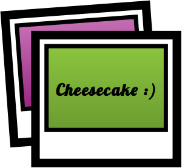

#cheesecake :)

A simple tethering software for your photo booth



## What is cheesecake?
Cheesecake is a very simple tethering software for your party photo booth.

Cheesecake "talks" to a camera connected to your computer and if you take a picture it will be downloaded directly into a specified session directory. Cheesecake can view new pictures immediately and show older pictures in an endles slide show.


##Features

  - Using [gphoto2](http://www.gphoto.org/proj/libgphoto2/support.php) and supporting more than 1800 cameras
  - A Simple image viewer with full screen support shows the last picture taken
  - The slide show mode can show all pictures taken during a session while new pictures are still shown immediately 

##Build

    apt-get install qt-sdk
    apt-get install gphoto2
    qmake
    make
  
##Usage

```
./cheesecake [--fullScreen] [--startSlideShow ] [--sessionDir DIR] [--help]
--fullScreen			Enable fullscreen mode on startup
--startSlideShow	    Enable slide show mode on startup
--sessionDir			Start a session in the specified directory
--help				    Prints this text and terminates cheesecake
```
